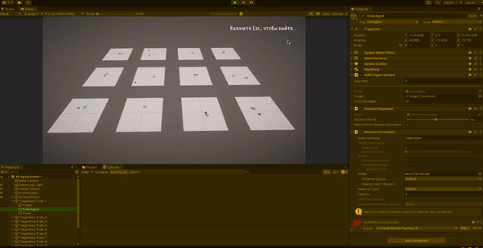
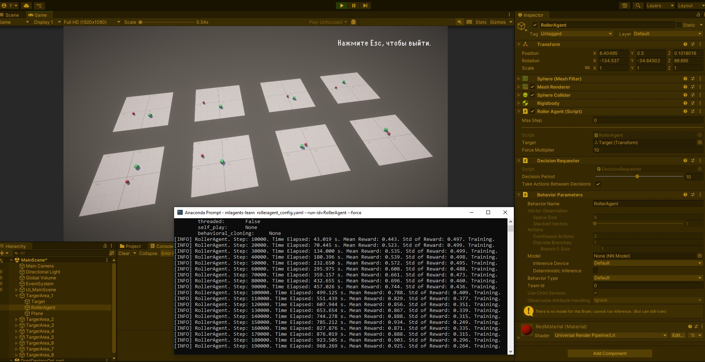
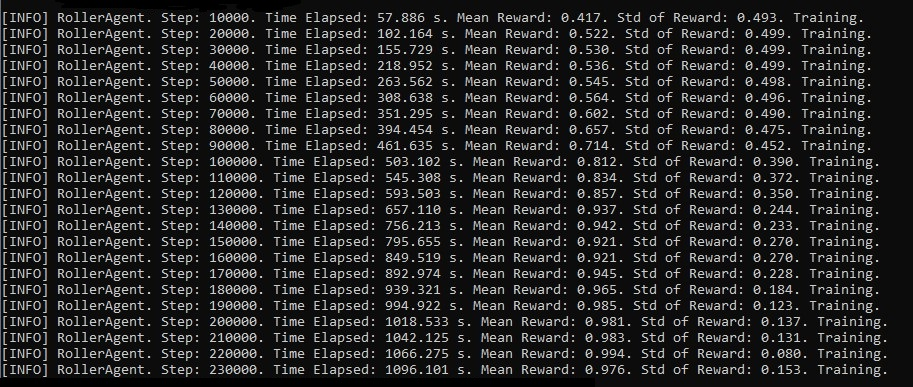
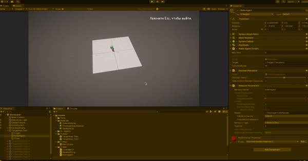
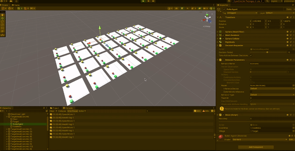
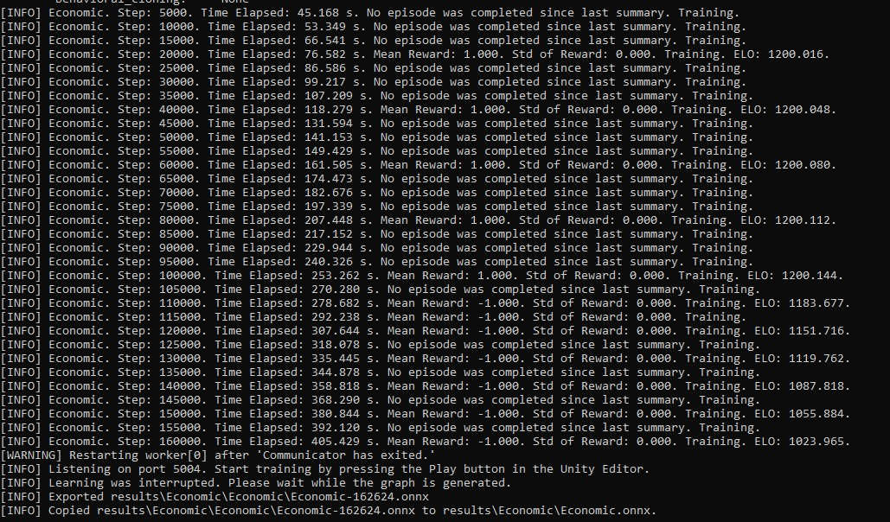
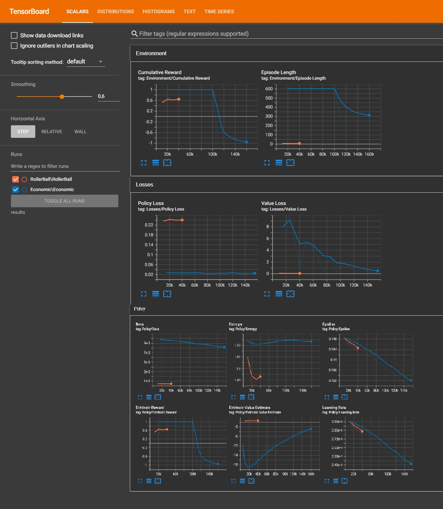
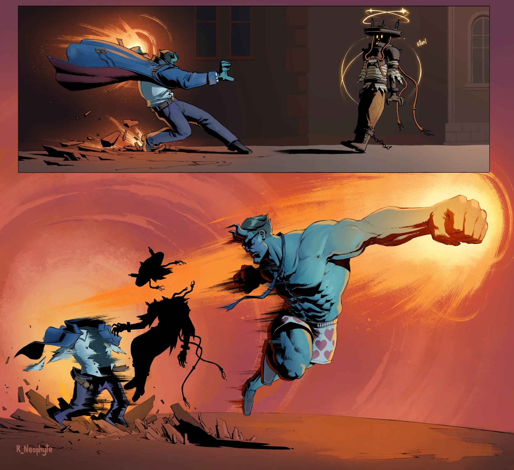

# Анализ данных и ИИ в разработке игр

### Отчёт по лабораторной работе №5

**Выполнила:**
- Жолдубаева Жанара Мирланбековна
- Группа 230911

| Задание | Выполнено | Баллы |
|---------|-----------|-------|
| Задание 1 | ✔️        | ?     |
| Задание 2 | ✔️        | ?     |
| Задание 3 | ✔️        | ?     |

**[Все задания выполнены]**

---

## Цель работы
Научиться применять инструменты для создания систем машинного обучения и их интеграции в игровой движок Unity.

---

## Введение

### Пример 1: Задание
**Описание задачи:** необходимо разработать ML-агента, который управляет шаром. Задача шара — оставаться на плоскости и находить перемещающийся куб в случайных координатах.

В процессе выполнения я настроила сцену, добавив приятные материалы и базовый интерфейс. Вместо стандартного Unity 3D использовала Unity URP для улучшения графики. После настройки проекта провела обучение модели. Результаты показаны ниже.

Обучение прошло успешно, но выявились редкие ошибки: если зелёный куб появляется далеко, шарик иногда не успевает среагировать и вылетает за пределы платформы. Повторное обучение снизило частоту таких ошибок, но полностью их избежать не удалось, вероятно из-за ограниченного пространства и случайного размещения куба.

Проект с реализацией загружен в репозиторий, ознакомиться можно [здесь](https://github.com/justKotCoder/AD_gamedev_lab5).

### Пример 2: Задание
По инструкции загрузила и настроила проект. Провела обучение и тестирование модели.

Процесс обучения:

Результаты:

График обучения:

Из графика видно, что модель прошла переобучение: на поздних этапах эффективность снизилась из-за резких скачков вознаграждения.

---

## Выполнение заданий

### Задание 1
**Изучение коэффициента корреляции в обучении модели.**

Коэффициент корреляции — это показатель, отражающий связь между параметрами. В рамках задачи он определяет, насколько агент эффективно реагирует на изменения в среде.

Эксперимент: увеличила максимальное расстояние до цели с 1.42 до 2.1. Результаты показали, что вознаграждение стало стабильнее, а отклонение — меньше. Это подтверждает, что корреляция влияет на способность агента адаптироваться к условиям задачи.

### Задание 2
**Изменение параметров файла yaml и их влияние на обучение.**

Изменённые параметры:
- **buffer_size** — увеличение ускорило обучение за счёт увеличения объёма данных.
- **num_epoch** — увеличение количества эпох не дало заметных изменений.
- **learning_rate** — изменение скорости обучения не оказало существенного влияния.

### Задание 3
**Применение ML-агентов в играх.**

- **Первый агент:** подходит для задач поиска цели в динамичной среде, например, управления врагами, которые следуют за игроком через сложные препятствия.
- **Второй агент:** оптимален для экономических стратегий, где NPC занимаются добычей ресурсов. Это упрощает адаптацию к изменениям в окружении.

ML-агенты наиболее полезны там, где классические алгоритмы требуют сложных и дорогих решений.

---

## Выводы
В ходе работы я изучила применение инструментов машинного обучения в Unity. Рассмотрела задачи для двух ML-агентов и протестировала их поведение с разными настройками. Полученные знания помогут создавать игровые механики с использованием современных технологий ИИ.

